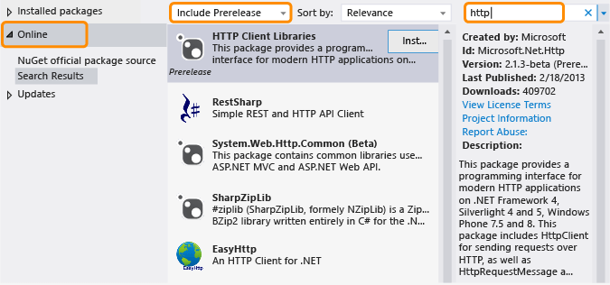

# Primeros pasos
Como se dijo en la seccion anterior, .NET Framework es un ambiente de desarrollo que se ejecuta en Windows y provee una variedad de servicios para desarrollar aplicaciones. Consiste en dos elementos: el common language runtime y la libreria de clases de .NET Framework. Los servicios que se proveen para apps son los siguientes:
- **Manejo de memoria:** El CLR se encarga de proveer espacios de memoria y administrarlos para conford del desarrollador.
- **Un sistema de tipado comun:** .Net Framework propociona un grupo de tipos basicos que son definidos por el sistema de tipado y son compatibles para todos los lenguajes que soporten .NET Framework.
- **Una extensa libreria de clase:** .Net Framework evita la interaccion con codigo de bajo nivel, los programadores pueden utilizar un grupo de librerias de tipos los miembros relacionados con .NET Framework Class Library.
- **Frameworks y tecnologias de desarrollo:** .Net Framework incluye libraries para areas de desarrollo especificas (ASP.NET, ADO.NET, etc)
- **interoperabilidad de lenguajes:** Haciendo uso del Common Intermediate Language, se emite un codigo intermedio que permite que lo escrito en un lenguaje sea accesible desde otro.
- **Compatibilidad de versiones:** .Net tiene la facilidad de tener una buena compatibiliada entre versiones, esto significa que lo escrito en una version particular puede funcionar en una version siguiente sin ninguna modificacion.
- **Ejecucion lado a lado:** Muchas versiones del CLR pueden coexistir en una computadora. Osea que muchas versiones de distitnas apps tambien pueden coestirir sin conflicto alguno.
- **Multitargeting:** Una vez que las aplicaciones estan basadas en el .NET Standard, los desarrolladores pueden crear y trabajar en distintas librerias que pueden ser compatibles con distintas versiones del .NET Framework platform (que tambien sea compatible con la version del estandar).

## .NET Framework desde la perspectiva del usuario
Si no se es desarrollador de .NET, pero si se utiliza este, no se necesita tener ningun conocimiento especifico de la plataforma o de como opera en el sistema operativo, en la mayoria de ociaciones el Framework es completamente transparente a los usuarios.

.NET Framework ya deberia estar instalado en su computadora (siempre y cuando se este utilizando Windows). En caso de instalar algun programa o aplicacion que necesite una version especifica, el propio setup se ocupara de instalarlo. 

No se recomienda desinstalar versiones de .NET Framework que ya vengan en la computadora por dos razones:
- Si alguna app tiene dependencia al entorno, este se rompera.
- Algunas versiones de .NET Framework son versiones de continuacion de versiones anteriores especificas. Con esto nos referimos a que, por ejemplo, .NET Framework 3.5 es una continuacion de la version 2.0, mientras que la versiones 4.8 es una continuacion de la version 4.7.2 y viceversa.

Si se planea desinstalar alguna version de .NET Framework **se recomienda utilizar siempre PROGRAMS AND FEATURES del panel de control**.

## .NET Framework desde la pespectiva de los desarrolladores
Para comenzar a desarrollar aplicaciones en .NET Framework, se debe hacer lo siguiente:
1. Si no se tiene preinstalado, instalar la version de .NET Framework en la que estara hecha la aplicacion. La ultima version de produccion es la 4.8
2. Seleccionar el lenguaje en el que se desarrollara el programa, debe ser soportado por .NET Framework. Entre las distintas opciones que se tiene existen Visual Basic, C#, F# y C++/CLI.
3. Seleccione e instale un entorno de desarrollo para iniciar el desarrollo. El IDE por defecto para el desarrollo de microsoft en .NET Framework es Visual studio. Esta disponible en distintas versiones.
## Lanzamientos out-of-band
Las versiones out-of-band son versiones sacadas fuera del tiempo normal de releases, estois mejorar los desarrollos ***cross platoform***.
Los paquetes OBB estan distribuidos en la plataforma NuGet, el cual es el gestor de packetes (dependencias) de .NET.
## Instalar paquetes NuGet OOB 
Teniendo instalado el NuGet Package Manager se puede utiliar el visual studio para instalar los paquetes nuget de la siguiente manera:
1. Abrir el menu de visual studio y elegir el **Manage NuGet Packages**. (Disponible en el menu del proyecto)
2. Elegir la opcion **Online**.
3. Se pueden seleccionar paquetes del tipo prelease, en la barra drop-down del panel medio, elegir **Include Prerelease** en lugar de **Stable Only**.
4. Utilizar la barra de busqueda para localizar el paquete que se vaya a utilizar. 

    

## Requisitos de instalacion

### Requisitos de Hardware

|  |  |
|---|---|
| Procesador | 1 GHz |
| RAM | 512 MB |
| **Espacio de disco (minimo)** | |
| 32-bit | 4.5 GB |
| 64-bit | 4.5 GB |

 

### Sistemas operativos de tipo cliente soportados

|Sistema operativo|Ediciones soportados|Versiones preinstaladas|Versiones instalables|
|---|---|---|---|
|Windows 10 actualizacion del 10 de mayo de 2020|32 y 64 bit|.NET Framework 4.8|--|
|Windows 10 actualizacion del 10 de noviembre de 2019|32 y 64 bit|.NET Framework 4.8|--|
|Windwos 10 actualizacion del 10 de mayo del 2019|32 y 64 bit|.NET Framework 4.8|--|
|Windows 10 actualizacion del 10 de octubre de 2018|32 y 64 bit|.NET Framework 7.2.8|.NER Framework 4.8|
|Windows 10 actualizacion del 10 de abril de 2018|32 y 64 bit|.NET Framework 4.7.2|.NET Framework 4.8|
|Windows 10 Fall Creators|32 y 64 bit|.NET Framework 4.7.1|.NET Framework 4.7.2   .NET Framework 4.8|
|Windows 10 creators update|32 y 64 bit|.NET Framework 4.7|.NET Framework 4.7.1   .NET Framework 4.7.2   .NET Framework 4.8|
|Windows 10 Anniversary Update|32 y 64 bit|.NET Framework 4.6.2|.NET Framework 4.7   .NET Framework 4.7.1   .NET Framework 4.7.2   .NET Framework 4.8|

### Sistemas operativos de tipo server soportados

 

|Sistema operativo|Ediciones soportadas|Versiones preinstaladas|Versiones instalables|
|---|---|---|---|
|Windows Server 2019|64 bit|.NET Framework 4.7.2|.NET Framework 4.8|
|Windows Server, version 1809|64 bit|.NET Framework 4.7|.NET Framework 4.8|
|Windows Server, version 1803|64 bit|.NET Framework 4.7.1|.NET Framework 4.7.2|
|Windows Server, version 1709|64 bit|.NET Framework 4.7.1|.NET Framework 4.7.2|
|Windows Server 2016|64 bit|.NET Framework 4.6.2|.NET Framework 4.7   .NET Framework 4.7.1   .NET Framework 4.7.2   .NET Framework 4.8|
|Windows Server 2012 R2|64 bit|.NET Framework 4.5.1|.NET Framework 4.5.2   .NET Framework 4.6   .NET Framework 4.6.1   .NET Framework 4.6.2   .NET Framework 4.7   .NET Framework 4.7.1   .NET Framework 4.7.2   .NET Framework 4.8|