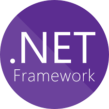
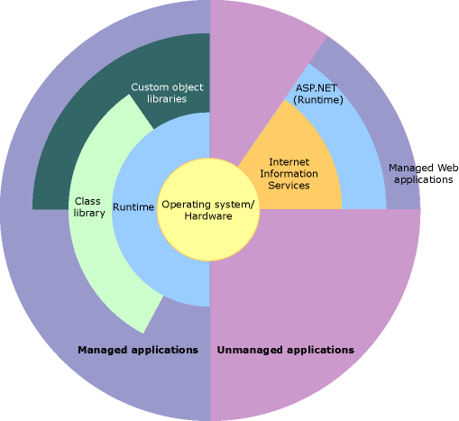

<h1 align="center">
    
    Capacitacion de .Net (Framework)
</h1>

.NET (pronunciado dotnet) Framework es una plataforma de desarrollo que permite la creacion y ejecucion de servicios web y aplicaciones en el sistema operativo windows. DotNet framework se ofrece lo siguiente:

- Un entorno de programacion orientada a objetos coherente en el que el codigo de los objetos se puede almacenar y ejecutar de forma local, ejecutar de forma local pero distribuida en internet o ejecutar de forma remota.

- Un entorno de ejecucion de codigo que:
    - Minimice los conflictos de implementacion de software y control de versiones.
    - Fomente la ejecucion segura de codigo, incluso del creado por terceros no conocidos o que no son de confianza.
    - Eliminar los problemas de rendimiento de los entornos con scripts o interpretados.
- Una experiencia coherente entre tipos de aplicaciones muy distintas, como las basadas en windows o en web.
- Basar toda la comunidad en estandares del sector para garantizar que el codigo basado en .NET Framework se integre con otor codigo.

```bnf
.NET Framework 4.8 es la ultima version de .NET Framework. Esto significa que no se publicaran las versiones de esta herramienta y se le dara seguimiento a .NET 5 y posteriores
```

.NET Framework esta compuesto por dos partes fundamentales: el common language runtime (CLR) y la libreria de clases de .NET framework. Se podria decir que el CLR es la base de .NET Framework. El tiempo de ejecucion es considerado un agente o administrador que maneja distintos aspectos del background del codigo, asi como la memoria, el manejo de hilos y las conexiones remotas. La libreria de clases es una coleccion de herramientas reutilizables y orientadas a objetos que sirve para desarrollar aplicaciones desde las tradicionales en linea de comandos hasta web apps.

La siguiente ilustracion nos muestra un poco mas de la relacion entre el CLR y la libreria de clases.

<p align="center">
    
</p>

<h2>Respecto a la libreria de clases de .NET</h2>

Como se dijo anteriormente, la libreria de clases de .NET Framework es una coleccion de herramientas reutilizables que se integran con el CLR. 

El set de herramientas de .NET sirve para desarrollar distintos tipos de apps y servicios:

- Aplicaciones de consola
- Windows GUI apps (Windows Forms)
- Windows Presentation Foundation apps
- ASP.NET apps
- Windows Services
- Aplicaciones orientadas a servicios utilizando Windows Communication Foundation
- Windows Workflow Foundation
